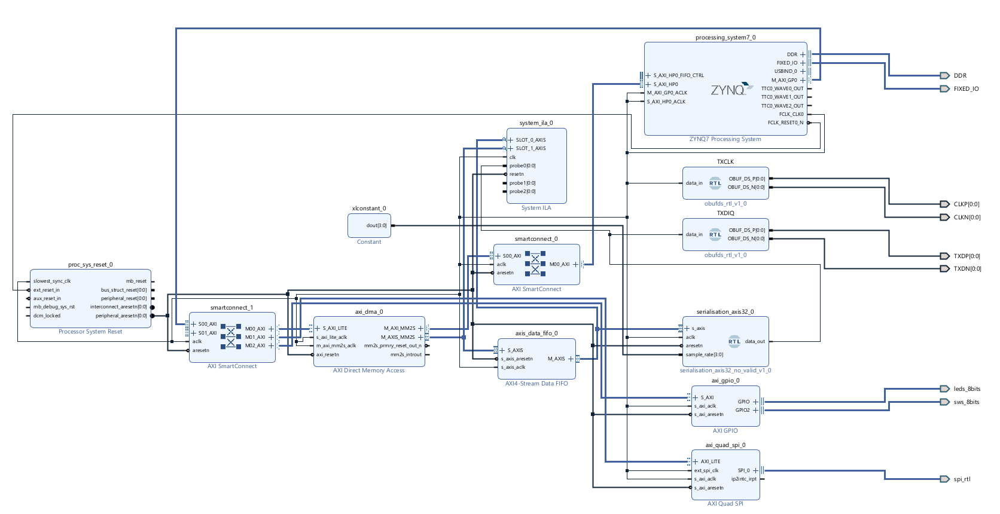
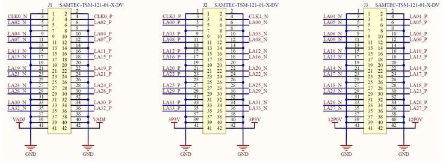
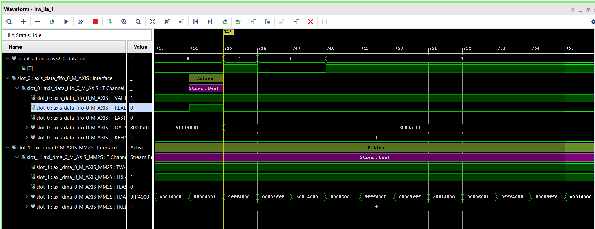

AT86RF215-XPRO with Zedboard
============================

The TX transceiver based on the ATREB215 module 
-----------------------------------------------

Implementation
**************
A Tx transceiver has been implemented on PL of the Zedboard in order to transmit at the end the IQ samples which are stored in the memory. 

* The TX interface contains essential elements,

PS elements:

1/ IQ sample storage function: In the xx function, the iq samples that were 
generated by the "gen-iq-samples.py" script are added.

2/ synchronization function: In which a process is set up to concatenate the
  Isync and Qsync after receiving respectively I and Q from the memory. adding
  Isync and Qsync is according to the word format described by the AT86RF215
  module.

PL elements:

3/ serialization block: In which a parallel to serial process is , this block is
  responsible of the serialization of the 32bits (the complete word) in order to
  get 32bits serialized data.

4/ OBUFFDS of Xilinx: Input Output Differential Buffers are very used in
  Vivado hardware tool because they allow us getting differential outputs which
  will be used for the LVDS transmission.

Zedboard pin's configuration
****************************

Zedboard supports the LVDS technical standard through its FMC interface. It supports the LVDS_25 standard that match with the AT86RF215. 
So in order to communicate with the AT86RF215 to recieve IQ samples, we need to set 2 differential pairs, one for CLK and one for data. 
The Figure below shows the pin assignments of the FMC LPC pins to the pin headers J1, J2, and J3. For differential pins, only we have to set the positive pin and vivado will configure the related negative pin directly. 

The sampling frequency was initially set to a fixed value of 2 Msps.

The PS clock is set to 64 MHz, which is the frequency supported by the AT86RF215.

.. code-block::
    :linenos:
    # LVDS 2.5V Config

    set_property PACKAGE_PIN M21 [get_ports {CKLP[0]}]
    set_property PACKAGE_PIN M22 [get_ports {CKLN[0]}]
    set_property PACKAGE_PIN C17 [get_ports {TXDP[0]}]
    set_property PACKAGE_PIN C18 [get_ports {TXDN[0]}]

    set_property IOSTANDARD LVDS_25 [get_ports {CKLP[0]}]
    set_property IOSTANDARD LVDS_25 [get_ports {CKLN[0]}]
    set_property IOSTANDARD LVDS_25 [get_ports {TXDP[0]}]
    set_property IOSTANDARD LVDS_25 [get_ports {TXDN[0]}]

LVDS output's results  
*********************
We can see the output of the serializer block and the Axi FIFO

